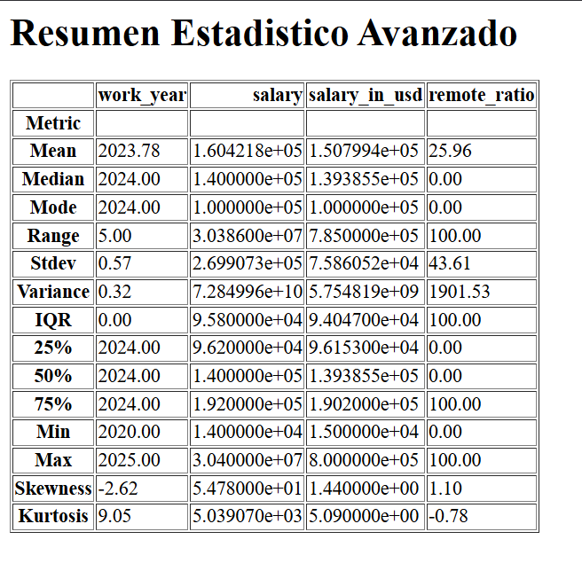
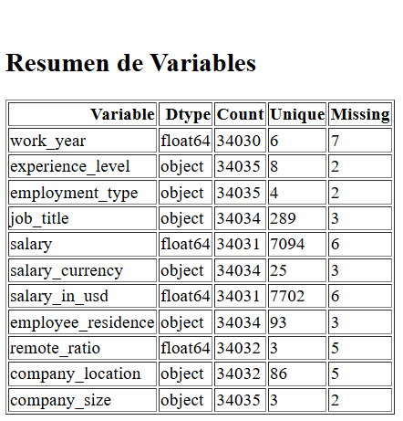
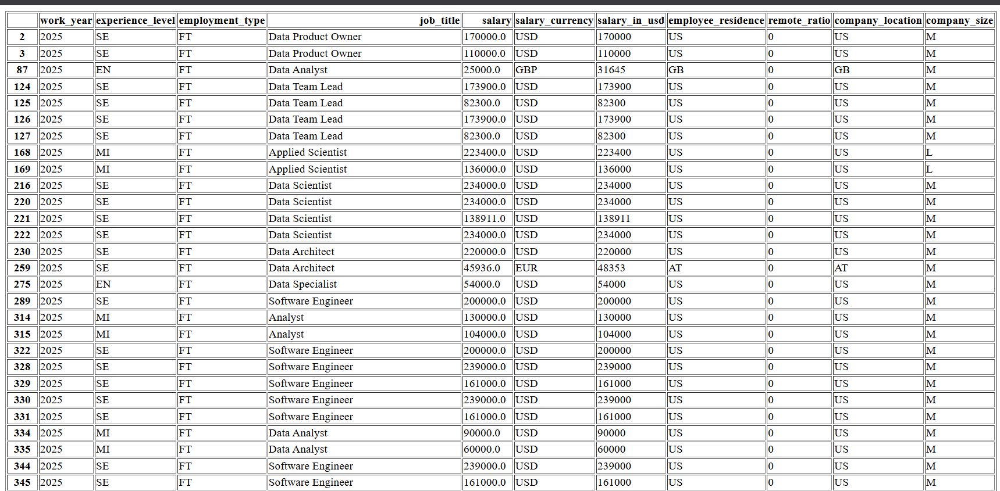

# Análisis Estadístico Avanzado de Datos usando Scipy, itertools y wordcloud

## Autor
Luis Octavio Lopez Martinez - 220096

## Descripción
Este proyecto realiza un análisis estadístico avanzado sobre un conjunto de datos de salarios en IA/ML, siguiendo los pasos y mejores prácticas de análisis de datos, utilizando las librerías: Scipy, itertools, wordcloud, pandas, numpy, matplotlib y seaborn.

---

## Actividades y Pasos Realizados

### 1. Libraries & Configurations
Se importaron y configuraron las librerías necesarias para el análisis, incluyendo la configuración visual de gráficos y la supresión de advertencias.


### 2. Load Dataset
Se cargó el dataset principal (`data/datos_actualizados.csv`). Se verifica la carga y se muestra información básica del DataFrame (info, head, describe).


### 3. Attribute Overview
Se exploran los atributos del dataset, mostrando tipos de datos, conteo de valores únicos y valores faltantes por columna.


### 4. Missing Value Handling
Se identifican y visualizan los valores nulos mediante un heatmap. Si existen valores nulos, se muestran en la gráfica correspondiente.


### 5. Duplicate Value Manage
Se detectan filas duplicadas en el dataset. Se eliminan y se guarda una versión limpia en `data/clean_data.csv`. Si existen duplicados, se exportan a `duplicados.html`.

### 6. Statistical Data Summary
Se genera un reporte estadístico avanzado en HTML (`reporte_estadistico.html`), que incluye:
- Medidas de tendencia central: Media, Mediana, Moda
- Medidas de dispersión: Varianza, Rango, Desviación Estándar, IQR, Percentiles
- Medidas de distribución: Curtosis (Kurtosis) y Asimetría (Skewness)
- Resumen de variables: tipo, cantidad, únicos y nulos

---






## Extras (Opcional)
- Exploratory Data Analysis
- Univariate Analysis
- Bivariate Analysis
- Multivariate Analysis

---

## Uso
1. Instala las dependencias:
   ```bash
   pip install -r requirements.txt
   ```
2. Ejecuta el script principal:
   ```bash
   python main.py
   ```
3. Los resultados y reportes se generarán en archivos HTML y PNG en el directorio del proyecto.

---
